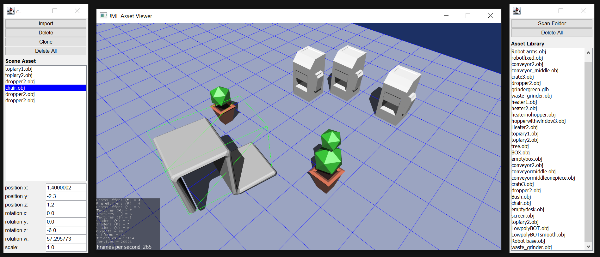

<a href="https://paypal.me/benckx/2">

</a>

# About

3D assets made in Blender don't always appear as expected in jMonkeyEngine games.

This tool is to help smooth work between 3D designers and developers, by providing 3D designers a simple GUI to quickly
test assets in a jMonkeyEngine scene and change their settings at runtime.



# How To

## Run

* **From the zip file:**
  * On Windows:
    * Decompress and simply run the bat file `viewer.bat`
    * `viewer_skip_jme.bat` will skip the jMonkeyEngine default settings screen, and the app will load with the last
      settings you selected (only resolution is saved to the preferences file so far, but other settings should follow)
    * The ZIP file contains both the app JAR and a JRE for Java 8.
    * On the Windows 10 warning message, click "More Info", then "Run anyway".
  * On Linux:
    * Run the JAR on Java 8: `java -jar jme-viewer.jar`
* **From source code:**
  * Run the Main file in your favorite IDE.

### Arguments

- `skip-jme` doesn't show the JME setting window on start-up
- `no-lighting` doesn't add lights to the scene

## Navigate the Scene

- Move with right-click or WASD keys
- Zoom in and out with mouse wheel
- Rotate with B and N or by pressing Left Control when moving with right-click

The app uses the [*ouistiti* camera manager library](https://github.com/benckx/ouistiti).

## Build

```
./gradlew clean build
```

## Update dependencies

```
 ./gradlew dependencyUpdates --refresh-dependencies
```

# Known Issues

## File Selection on Linux

```
X Error of failed request:  BadWindow (invalid Window parameter)
  Major opcode of failed request:  20 (X_GetProperty)
  Resource id in failed request:  0x9c0007c
  Serial number of failed request:  2511
  Current serial number in output stream:  2511
```

It doesn't happen when only the GUI is loaded.

## Offset Bounding Box

The green Bounding Box that highlights asset selection in the JME scene shifts out of its center when the asset is
scaled or rotated. I think it has to do with the w rotation parameter, as I don't fully
understand [Quaternion](https://javadoc.jmonkeyengine.org/v3.4.0-stable/index.html) yet

# Change logs

## Version 1.1

* Fix bug where cloned assets would not be found on scene reload
* Delete selected asset from scene with the DELETE key
* Fix spelling mistakes

## Version 1.0

* Import/Add Assets to the scene
* Move, rotate, scale assets (by editing text fields values or with mouse wheel)
* Delete an asset from the scene
* Clone/Duplicate an asset from the scene
* Scan folders and list all assets to the "Library" panel
* Automatic save of the scene

# Related Projects

* **ouistiti**: A basic camera manager for management/strategy games:<br/>
  https://github.com/benckx/ouistiti
* **chimp-utils**: A collection of Kotlin APIs and helpers for jMonkeyEngine:<br/>
  https://github.com/benckx/chimp-utils
* **jme-asset-viewer**: Minimalist GUI to preview/test 3D assets in a jMonkeyEngine scene:<br/>
  https://github.com/benckx/jme-asset-viewer
